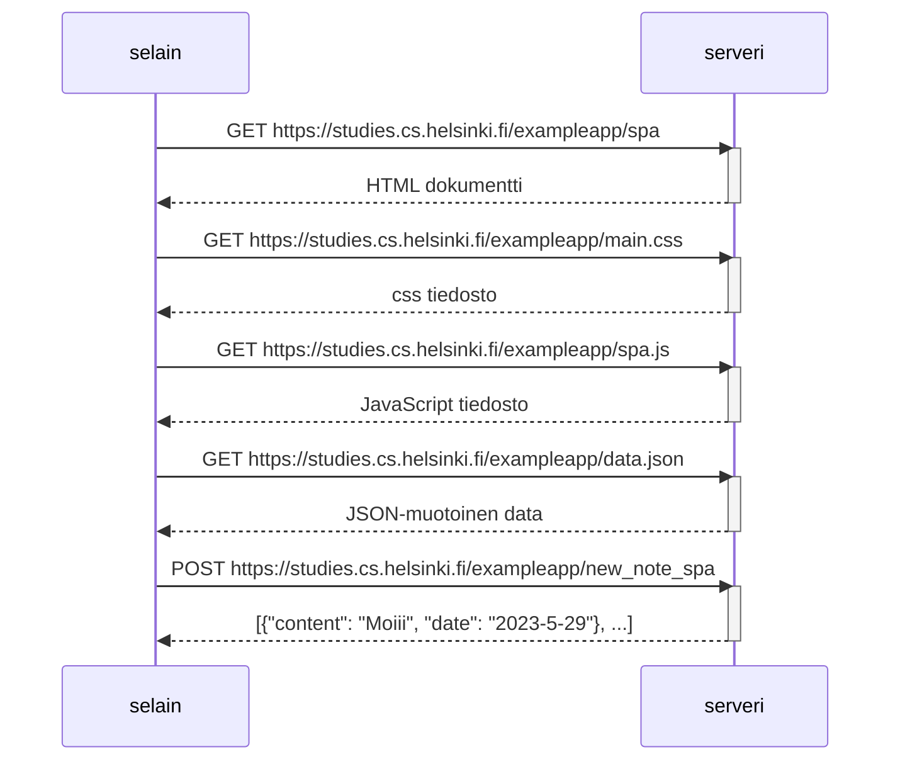

```mermaid
sequenceDiagram
    participant selain
    participant serveri

    selain->>serveri: GET https://studies.cs.helsinki.fi/exampleapp/spa
    activate serveri
    serveri-->>selain: HTML dokumentti
    deactivate serveri

    selain->>serveri: GET https://studies.cs.helsinki.fi/exampleapp/main.css
    activate serveri
    serveri-->>selain: css tiedosto
    deactivate serveri

    selain->>serveri: GET https://studies.cs.helsinki.fi/exampleapp/spa.js
    activate serveri
    serveri-->>selain: JavaScript tiedosto
    deactivate serveri

    selain->>serveri: GET https://studies.cs.helsinki.fi/exampleapp/data.json
    activate serveri
    serveri-->>selain: JSON-muotoinen data
    deactivate serveri

    selain->>serveri: POST https://studies.cs.helsinki.fi/exampleapp/new_note_spa
    activate serveri
    serveri-->>selain: [{"content": "Moiii", "date": "2023-5-29"}, ...]
    deactivate serveri
    
```
