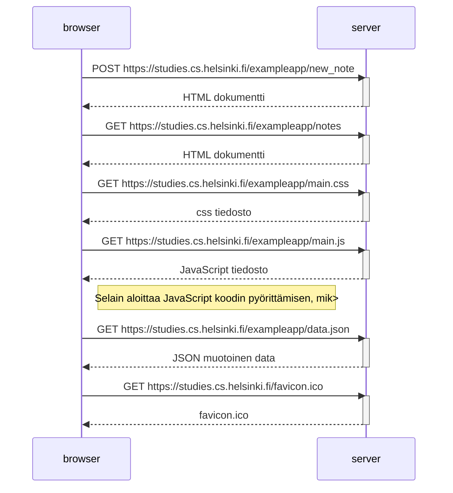

```mermaid
sequenceDiagram
    participant browser
    participant server

    browser->>server: POST https://studies.cs.helsinki.fi/exampleapp/new_note
    activate server
    server-->>browser: HTML dokumentti
    deactivate server

    browser->>server: GET https://studies.cs.helsinki.fi/exampleapp/notes
    activate server
    server-->>browser: HTML dokumentti
    deactivate server

    browser->>server: GET https://studies.cs.helsinki.fi/exampleapp/main.css
    activate server
    server-->>browser: css tiedosto
    deactivate server

    browser->>server: GET https://studies.cs.helsinki.fi/exampleapp/main.js
    activate server
    server-->>browser: JavaScript tiedosto
    deactivate server

    Note right of browser: Selain aloittaa JavaScript koodin pyörittämisen, mik>

    browser->>server: GET https://studies.cs.helsinki.fi/exampleapp/data.json
    activate server
    server-->>browser: JSON muotoinen data
    deactivate server

    browser->>server: GET https://studies.cs.helsinki.fi/favicon.ico
    activate server
    server-->>browser: favicon.ico
    deactivate server
```

